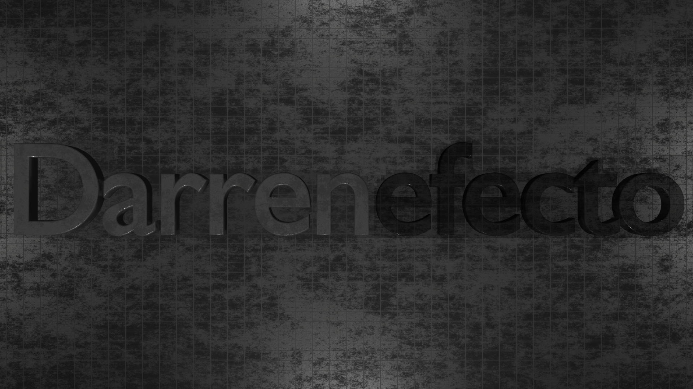

<h3>Hello, I'm Darrenefecto</h3>
<b>I'm a game developer/programmer and 3D-Artist with years of experience.</b>
<h4><a href="https://darrenefecto.github.io/">Goto My Website</a></h4> 

<h2> 📡 &nbsp;My Socials</h2>

  
  

<h2> 👨‍💻 &nbsp;Some Programming Languages I Learned</h2>

  
  
  
  
  

<h2> 🛠 &nbsp;Some Tools I Have Used and Learned</h2>

  
  
  
  
  

<h2> 💻 &nbsp;Some System Operators I Know</h2>

  
  

