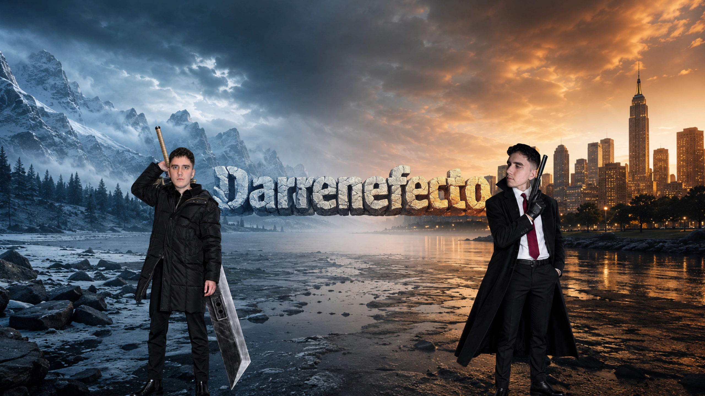

  

<h1 align="center">Hi, I'm Darrenefecto</h1>

Game Developer • Programmer • 3D Artist

Building games, graphics systems and interactive experiences.

  <a href="https://darrenefecto.github.io/">Website</a> •
  <a href="https://instagram.com/darrenefecto">Instagram</a> •
  <a href="https://youtube.com/@darrenefecto">YouTube MUSIC</a> •
  <a href="https://youtube.com/@DarrenefectoTV">YouTube GAMING</a>

---

## About Me

* 🎮 Game development with practical production experience
* 🧠 Programming with focus on performance and interactive systems
* 🎨 3D art, asset creation and visual workflows
* ⚙️ Interested in graphics programming and real-time rendering

---

## Tech Stack

### Languages

  
  
  
  
  

### Tools & Engines

  
  
  
  
  
  
  

### Platforms

  
  

---

## GitHub Stats

  

---

## Current Focus

* Game systems
* Rendering & graphics
* 3D pipelines
* Experimental projects
